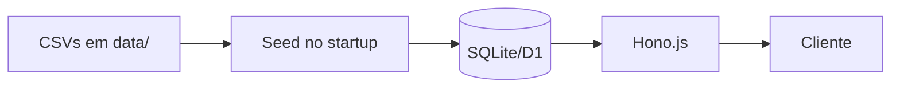

# Diagramas

_Em construção._

## Planejados

- **C4 nível 1** — System Context (quem consome o RefSUS, de onde vêm os dados)
- **C4 nível 2** — Containers (API, Web, D1, CSVs)
- **Fluxo de dados** — CSV → seed → banco → API → cliente
- **Fluxo de deploy** — push → CI → Cloudflare

## Formato

Preferir **Mermaid** (renderiza no GitHub) sobre PNGs. Exemplo:

````markdown

````

PNG/SVG só quando Mermaid não dá conta (ex: diagramas de domínio complexos).
